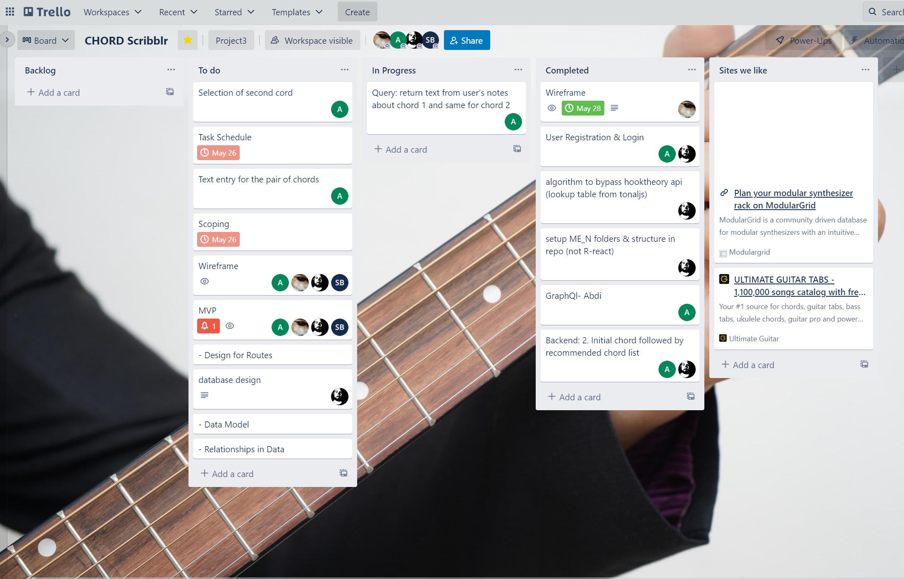

# project3

Summary of Project: Practice tool for chord changes, and building muscle memory of those chords. Users have a practice journal where they can attach written notes/thoughts to chord changes for their reflection/progress. (perhaps out of mvp scope: liking/commenting. Maybe top 10 progressions (maybe by most used). 

Roles: 
- Sevan: Design, Wireframing, Presentation
- Michael: Database, Backend stuff, music theory stuff. 
- Oleksandr
- Echeta: Front End, 
- Abdi: GraphQL

Team Name: The Reduxers
Link to Repo: https://github.com/michaelpalumbo/project3


## Screenshot of App


## Setup (dev-version):

1. In root folder run ```npm install```
2. cd into server folder and run ``npm install``
3. cd into client folder and run ``npm install``
4. cd back into root folder and run `` npm run develop ``
(this will run the full stack of the application)


## Technologies Used
- React
- GraphQL
- Bootstrap
- TonalJS
- Chords-Scales API
- TonalJS
- nodeJS
- Apollo


## Link for the repo
https://github.com/michaelpalumbo/project3


## Deployment Link
https://chordscribbles.herokuapp.com/


## Trello board
https://trello.com/b/SFHIjiTe/chord-scribblr



